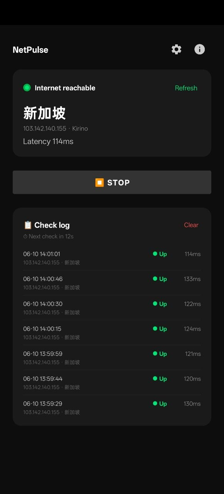

<div align="center">
  <h1>NetPulse — Website</h1>
  <p>
    <strong>Marketing &amp; download landing page for NetPulse</strong><br/>
    a lightweight connectivity &amp; exit-IP monitor for Android by ShuttleLab.
  </p>
  <p>
    🌐 <a href="https://netpulse.shuttlelab.org">netpulse.shuttlelab.org</a>
    &nbsp;·&nbsp;
    📱 Android app source: <a href="https://github.com/ShuttleLab/NetPulse">ShuttleLab/NetPulse</a>
  </p>
  <p>
    
  </p>
</div>

> **This repo is just the website.** The NetPulse Android app (Kotlin) lives at **[ShuttleLab/NetPulse](https://github.com/ShuttleLab/NetPulse)**. Bilingual (English / 中文), static export, runs anywhere.

## Features

- **Landing page** — hero, feature overview, screenshots, how-it-works, and a download call-to-action.
- **Download** — links to the latest APK on GitHub Releases (a Google Play badge is reserved for later via a flag in `app/[locale]/page.tsx`).
- **Privacy policy** — discloses exactly what the app does, the permissions it uses, and the external IP-geolocation services it contacts (`ip.im` in English, `ip9.com.cn` in Chinese).
- **Bilingual** — English and Chinese via URL-based i18n (next-intl).
- **Themeable** — ShuttleLab purple palette with light/dark/system appearance.

## Run locally

```bash
npm install
npm run dev
```

(During development open `/en` or `/zh` — `/` is promoted to English only in the production build.)

## Build

```bash
npm run build
```

Output is in `out/` for static deployment to Cloudflare Workers.

## License

Licensed under the GNU Affero General Public License v3.0 — see [LICENSE](./LICENSE).
